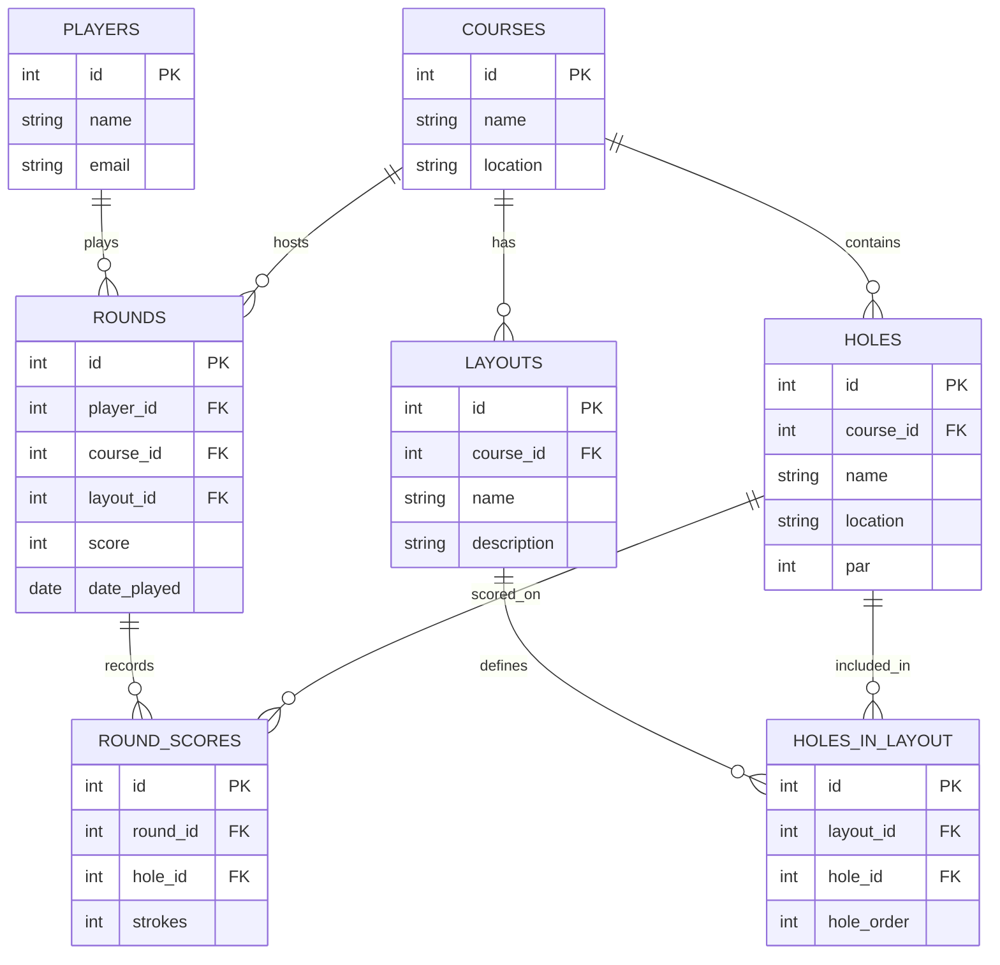

# disc-golf-app

```mermaid
erDiagram
    PLAYERS ||--o{ ROUNDS : plays
    COURSES ||--o{ ROUNDS : hosts
    COURSES ||--o{ LAYOUTS : has
    COURSES ||--o{ HOLES : contains
    LAYOUTS ||--o{ HOLES_IN_LAYOUT : defines
    HOLES ||--o{ HOLES_IN_LAYOUT : included_in
    ROUNDS ||--o{ ROUND_SCORES : records
    HOLES ||--o{ ROUND_SCORES : scored_on

    PLAYERS {
        int id PK
        string name
        string email
    }

    COURSES {
        int id PK
        string name
        string location
    }

    LAYOUTS {
        int id PK
        int course_id FK
        string name
        string description
    }

    HOLES {
        int id PK
        int course_id FK
        string name
        string location
        int par
    }

    HOLES_IN_LAYOUT {
        int id PK
        int layout_id FK
        int hole_id FK
        int hole_order
    }

    ROUNDS {
        int id PK
        int player_id FK
        int course_id FK
        int layout_id FK
        int score
        date date_played
    }

    ROUND_SCORES {
        int id PK
        int round_id FK
        int hole_id FK
        int strokes
    }
```
